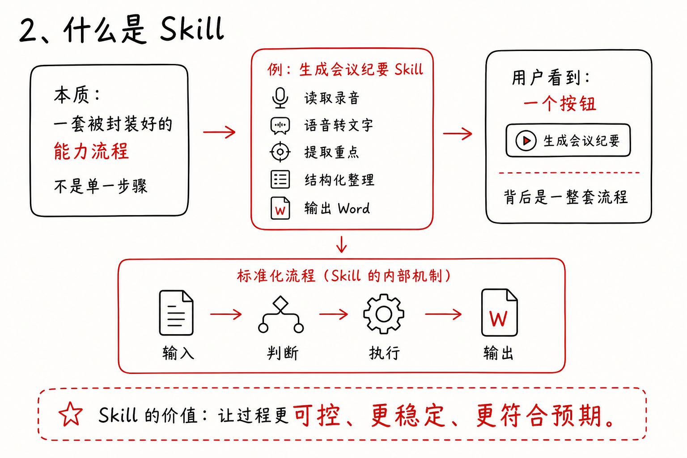

# Whiteboard Infographic Skill

Turn Chinese explainer text, course notes, product concepts, or lesson scripts into a clean black-white-red hand-drawn whiteboard infographic.

This skill is built for teaching visuals that should feel like a polished course whiteboard: warm white canvas, handwritten Chinese title, black marker text, thin red outlines, red arrows, simple line icons, and a strong final takeaway.

## What It Does

`whiteboard-infographic` compresses a block of text into one visual explanation.

It is especially useful for:

- Course slides and teaching boards
- Xiaohongshu or Bilibili knowledge cards
- Product concept explanations
- AI workflow diagrams
- "What is X" explainer graphics
- Before/after or old/new comparison visuals

The goal is not to make a colorful poster. The goal is to make the idea instantly understandable.

## Visual Style

The default style is intentionally restrained:

- White or warm-white 3:2 landscape canvas
- Large handwritten Chinese title at top-left
- Mostly black marker text
- Red only for the thesis, arrows, outlines, and key emphasis
- Thin black/red rounded outline boxes
- Simple black/red line icons
- Short bullets instead of paragraphs
- Lots of whitespace

Avoid:

- Dark backgrounds
- Gradients and decorative blobs
- Corporate dashboard layouts
- Colorful filled cards
- Tiny Chinese text
- Photorealistic elements

## Example

Input text:

```text
Skill 是整个课程里非常关键的概念。
Skill 本质上可以理解成：一套被封装好的能力流程。
它不是单一步骤，而是一整套输入、判断、执行、输出的标准化流程。
例如，“生成会议纪要”这个 Skill，背后可能包含读取录音、语音转文字、
提取重点、结构化整理、输出 Word。
用户只看到一个按钮，但实际上后面是一整套流程。
Skill 的价值，是让整个过程更可控、更稳定、更符合预期。
```

Generated result:



## How To Use

In Codex, call the skill by name:

```text
$whiteboard-infographic 帮我把下面这段文字生成黑白红手写白板风格的信息图：
...
```

You can also request a specific layout:

```text
$whiteboard-infographic 用 comparison 布局，把下面内容做成“聊天机器人 vs Agent”的对比图：
...
```

Supported layout patterns:

- `lesson-flow`: for "what is X", mechanisms, and cause/effect explanations
- `comparison`: for A vs B, old vs new, before vs after
- `capability-map`: for systems, products, tools, and capability lists
- `dense-board`: for longer notes with 4-6 compact sections

## Prompt Helper

The skill includes a small helper script for creating a stable image-generation prompt:

```bash
python3 scripts/build_prompt.py --text "你的输入文字"
python3 scripts/build_prompt.py --file input.txt --layout lesson-flow
python3 scripts/build_prompt.py --text "你的输入文字" --layout comparison --orientation portrait
```

## Repository Structure

```text
.
├── SKILL.md
├── README.md
├── agents/
│   └── openai.yaml
├── examples/
│   └── skill-example.png
├── references/
│   └── style-guide.md
└── scripts/
    └── build_prompt.py
```

## Design Principle

Good infographic output should pass a simple test:

The viewer should understand the main idea in under three seconds, then understand the mechanism after another ten seconds.

This skill optimizes for that kind of clarity.
